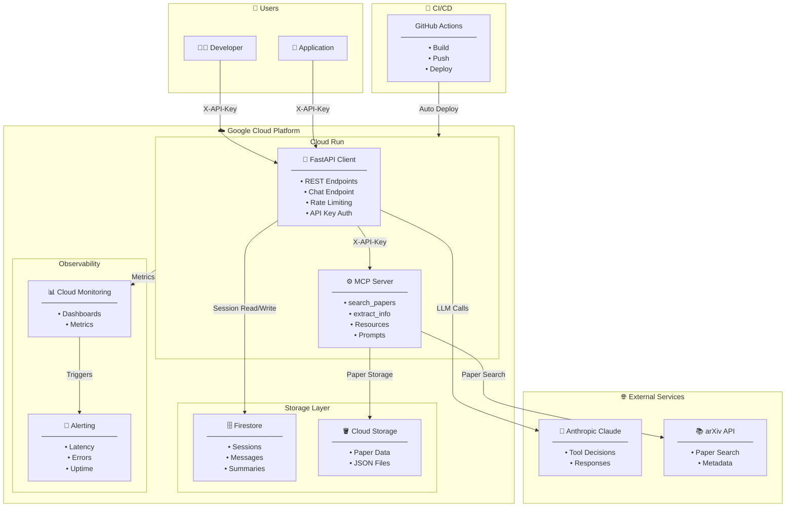
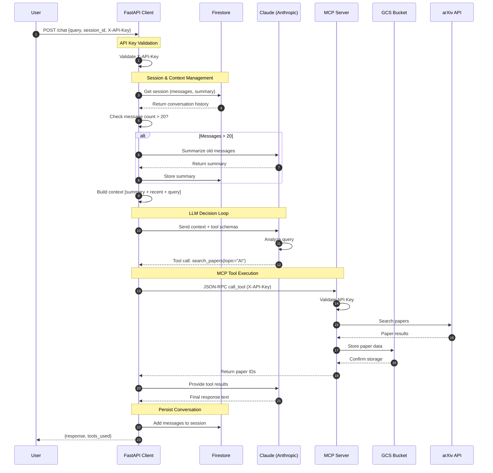
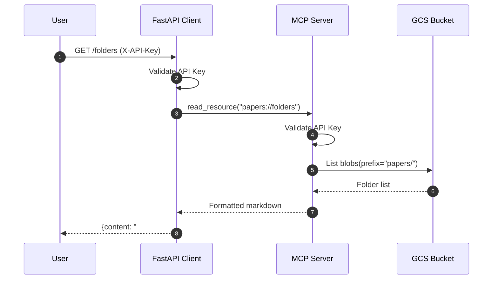
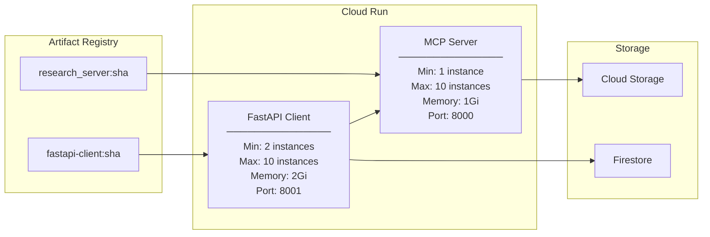
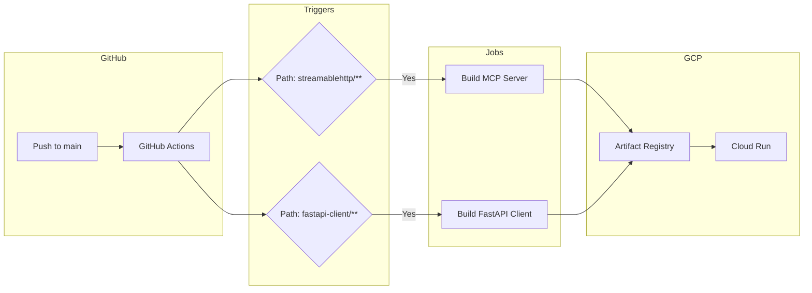
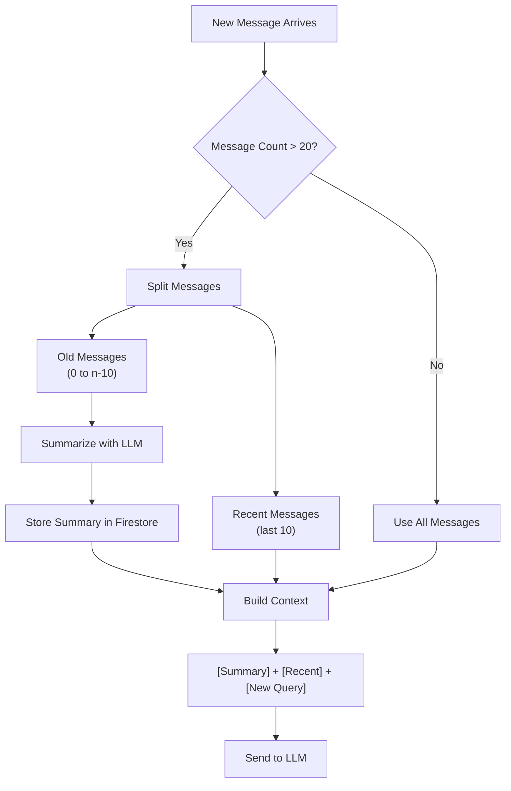

# Scholar AI

A production-grade AI research assistant built on the **Model Context Protocol (MCP)**, featuring multi-turn conversations, hybrid context management, and enterprise-ready deployment on Google Cloud Platform.

[](https://github.com/AvinashBolleddula/scholar-ai/actions)
(https://github.com/AvinashBolleddula/MCP-Build-Rich-Context-AI-Apps-with-Anthropic/actions)
[](https://opensource.org/licenses/MIT)

---

## Table of Contents

- [Overview](#overview)
- [Architecture](#architecture)
- [End-to-End Request Flow](#end-to-end-request-flow)
- [Features](#features)
- [Tech Stack](#tech-stack)
- [Project Structure](#project-structure)
- [Getting Started](#getting-started)
- [API Reference](#api-reference)
- [Authentication](#authentication)
- [Deployment](#deployment)
- [CI/CD Pipeline](#cicd-pipeline)
- [Monitoring & Alerting](#monitoring--alerting)
- [Context Management](#context-management)
- [Testing](#testing)
- [Contributing](#contributing)
- [License](#license)

---

## Overview

This project demonstrates a **production-aligned implementation** of the Model Context Protocol (MCP), showcasing how to build scalable AI systems with:

- **MCP Server**: Exposes research tools (arXiv paper search, extraction) via JSON-RPC 2.0
- **FastAPI Client**: RESTful API layer with LLM-powered chat endpoint
- **Multi-turn Conversations**: Persistent sessions with Firestore
- **Hybrid Context Management**: Summarization + sliding window for long conversations
- **Enterprise Security**: Two-layer API key authentication
- **Cloud-Native Deployment**: Google Cloud Run with auto-scaling

---

## Architecture


---

## End-to-End Request Flow

### Chat Request with Tool Execution


### Direct API Request Flow


---

## Features

### Core Capabilities

| Feature | Description |
|---------|-------------|
| **MCP Protocol** | JSON-RPC 2.0 over Streamable HTTP transport |
| **Tool Execution** | LLM-driven tool selection and execution |
| **Resources** | Queryable data endpoints (`papers://folders`, `papers://{topic}`) |
| **Prompts** | Reusable prompt templates for guided workflows |

### Production Features

| Feature | Description |
|---------|-------------|
| **Multi-turn Conversations** | Persistent sessions via Firestore |
| **Hybrid Context Management** | Summarization + sliding window (20 messages) |
| **Two-layer Authentication** | API keys on both FastAPI and MCP Server |
| **Rate Limiting** | Per-endpoint limits (5-30 req/min) |
| **Input Validation** | Pydantic models with constraints |
| **Request Timeouts** | 10s for endpoints, 90s for chat |
| **Response Caching** | In-memory cache for read-only endpoints |

### DevOps & Observability

| Feature | Description |
|---------|-------------|
| **CI/CD** | GitHub Actions with path-based triggers |
| **Monitoring** | Cloud Monitoring dashboards |
| **Alerting** | Latency, error rate, uptime alerts |
| **Auto-scaling** | 2-10 instances based on load |

---

## Tech Stack

| Layer | Technology |
|-------|------------|
| **MCP Server** | Python, FastMCP, Uvicorn |
| **API Client** | FastAPI, Pydantic, HTTPX |
| **LLM** | Anthropic Claude (claude-sonnet-4-20250514) |
| **Database** | Google Firestore |
| **Storage** | Google Cloud Storage |
| **Deployment** | Google Cloud Run |
| **CI/CD** | GitHub Actions |
| **Monitoring** | Google Cloud Monitoring |
| **Package Management** | uv |

---

## Project Structure
```
scholar-ai/
├── .github/
│   └── workflows/
│       ├── deploy-mcp-server.yml    # MCP Server CI/CD
│       └── deploy-fastapi.yml       # FastAPI Client CI/CD
│
├── streamablehttp/                   # MCP Server
│   ├── research_server.py           # Tools, Resources, Prompts
│   ├── mcp_chatbot.py               # CLI Client (development)
│   ├── server_config.json           # Server configuration
│   ├── Dockerfile
│   ├── pyproject.toml
│   └── .dockerignore
│
├── fastapi-client/                   # FastAPI Client
│   ├── main.py                      # API endpoints
│   ├── mcp_client.py                # MCP connection handler
│   ├── conversation_store.py        # Firestore operations
│   ├── context_manager.py           # Summarization & context
│   ├── tests/
│   │   ├── __init__.py
│   │   ├── test_context_manager.py
│   │   └── test_endpoints.py
│   ├── Dockerfile
│   ├── pyproject.toml
│   └── .dockerignore
│
└── README.md
```

---

## Getting Started

### Prerequisites

- Python 3.11+
- [uv](https://github.com/astral-sh/uv) package manager
- Google Cloud account with billing enabled
- Anthropic API key

### Local Development Setup

#### 1. Clone the Repository
```bash
git clone https://github.com/AvinashBolleddula/scholar-ai.git
cd scholar-ai
```

#### 2. Set Up MCP Server
```bash
cd streamablehttp
uv venv
source .venv/bin/activate
uv sync

# Create .env file
cat > .env << EOF
MCP_API_KEY=your-mcp-api-key
EOF

# Run locally
uv run research_server.py
```

#### 3. Set Up FastAPI Client
```bash
cd ../fastapi-client
uv venv
source .venv/bin/activate
uv sync

# Create .env file
cat > .env << EOF
MCP_SERVER_URL=http://127.0.0.1:8000/mcp
MCP_API_KEY=your-mcp-api-key
ANTHROPIC_API_KEY=your-anthropic-api-key
FASTAPI_API_KEY=your-fastapi-api-key
EOF

# Authenticate for Firestore (local development)
gcloud auth application-default login

# Run locally
uvicorn main:app --reload --port 8001
```

#### 4. Test the Setup
```bash
# Health check
curl http://127.0.0.1:8001/health

# Search papers (with API key)
curl -X POST http://127.0.0.1:8001/search \
  -H "Content-Type: application/json" \
  -H "X-API-Key: your-fastapi-api-key" \
  -d '{"topic": "machine learning", "max_results": 3}'
```

---

## API Reference

### Base URL
```
Production: https://fastapi-client-225547455314.us-central1.run.app
Local:      http://127.0.0.1:8001
```

### Authentication

All endpoints (except `/`, `/health`, `/docs`) require `X-API-Key` header.
```bash
curl -H "X-API-Key: your-api-key" https://api.example.com/endpoint
```

### Endpoints

#### Health & Info

| Method | Endpoint | Description | Auth |
|--------|----------|-------------|------|
| GET | `/` | API information | No |
| GET | `/health` | Health check | No |
| GET | `/docs` | Swagger UI | No |

#### Tools (MCP)

| Method | Endpoint | Description | Auth |
|--------|----------|-------------|------|
| POST | `/search` | Search arXiv papers | Yes |
| GET | `/paper/{paper_id}` | Get paper details | Yes |
| GET | `/tools` | List available tools | Yes |

#### Resources (MCP)

| Method | Endpoint | Description | Auth |
|--------|----------|-------------|------|
| GET | `/folders` | List available topics | Yes |
| GET | `/topics/{topic}` | Get papers by topic | Yes |

#### Prompts (MCP)

| Method | Endpoint | Description | Auth |
|--------|----------|-------------|------|
| GET | `/prompts` | List available prompts | Yes |
| GET | `/prompts/{name}` | Execute prompt template | Yes |

#### Chat (LLM-Powered)

| Method | Endpoint | Description | Auth |
|--------|----------|-------------|------|
| POST | `/chat` | Natural language chat | Yes |
| POST | `/session` | Create conversation session | Yes |
| GET | `/sessions` | List user's sessions | Yes |

### Request/Response Examples

#### Create Session
```bash
curl -X POST https://api.example.com/session \
  -H "X-API-Key: your-key"
```
```json
{
  "session_id": "550e8400-e29b-41d4-a716-446655440000"
}
```

#### Chat with Session
```bash
curl -X POST https://api.example.com/chat \
  -H "Content-Type: application/json" \
  -H "X-API-Key: your-key" \
  -d '{
    "query": "Find 5 papers about transformer architecture",
    "session_id": "550e8400-e29b-41d4-a716-446655440000"
  }'
```
```json
{
  "response": "I found 5 papers on transformer architecture:\n\n1. **Attention Is All You Need** (1706.03762v7)...",
  "tools_used": [
    {
      "tool": "search_papers",
      "input": {"topic": "transformer architecture", "max_results": 5}
    }
  ]
}
```

#### Search Papers (Direct)
```bash
curl -X POST https://api.example.com/search \
  -H "Content-Type: application/json" \
  -H "X-API-Key: your-key" \
  -d '{"topic": "neural networks", "max_results": 3}'
```
```json
{
  "paper_ids": ["2508.14704v1", "2506.11019v1", "2504.11094v2"],
  "message": "Found papers on 'neural networks'"
}
```

### Rate Limits

| Endpoint | Limit |
|----------|-------|
| `/chat` | 5/minute |
| `/search` | 10/minute |
| All others | 30/minute |

---

## Authentication

### Two-Layer Security Model
```
┌─────────────────────────────────────────────────────────────────┐
│                      Authentication Flow                        │
├─────────────────────────────────────────────────────────────────┤
│                                                                 │
│   User Request                                                  │
│        │                                                        │
│        ▼                                                        │
│   ┌─────────────────────────────────────────┐                  │
│   │         FastAPI Client                   │                  │
│   │   ┌─────────────────────────────────┐   │                  │
│   │   │     API Key Middleware          │   │                  │
│   │   │  Validates: FASTAPI_API_KEY     │   │                  │
│   │   └─────────────────────────────────┘   │                  │
│   └─────────────────────────────────────────┘                  │
│        │                                                        │
│        │ Internal request (hidden key)                         │
│        ▼                                                        │
│   ┌─────────────────────────────────────────┐                  │
│   │         MCP Server                       │                  │
│   │   ┌─────────────────────────────────┐   │                  │
│   │   │     API Key Middleware          │   │                  │
│   │   │  Validates: MCP_API_KEY         │   │                  │
│   │   └─────────────────────────────────┘   │                  │
│   └─────────────────────────────────────────┘                  │
│                                                                 │
└─────────────────────────────────────────────────────────────────┘
```

### Key Distribution

| Key | Who Has It | Purpose |
|-----|------------|---------|
| `FASTAPI_API_KEY` | End users/developers | Access FastAPI endpoints |
| `MCP_API_KEY` | FastAPI server only | Internal MCP communication |
| `ANTHROPIC_API_KEY` | FastAPI server only | LLM API calls |

### Security Features

- **DNS Rebinding Protection**: Host validation on MCP Server
- **Rate Limiting**: Prevents abuse and controls costs
- **Input Validation**: Pydantic models with constraints
- **HTTPS**: Enforced by Cloud Run

---

## Deployment

### Infrastructure Overview


### Manual Deployment

#### MCP Server
```bash
cd streamablehttp

# Build
docker build --platform linux/amd64 \
  -t us-central1-docker.pkg.dev/PROJECT_ID/research-server-repo/research_server:latest .

# Push
docker push us-central1-docker.pkg.dev/PROJECT_ID/research-server-repo/research_server:latest

# Deploy
gcloud run deploy research-server-run \
  --image us-central1-docker.pkg.dev/PROJECT_ID/research-server-repo/research_server:latest \
  --region us-central1 \
  --allow-unauthenticated \
  --memory 1Gi \
  --port 8000 \
  --set-env-vars="MCP_API_KEY=your-key"
```

#### FastAPI Client
```bash
cd fastapi-client

# Build
docker build --platform linux/amd64 \
  -t us-central1-docker.pkg.dev/PROJECT_ID/fastapi-client-repo/fastapi-client:latest .

# Push
docker push us-central1-docker.pkg.dev/PROJECT_ID/fastapi-client-repo/fastapi-client:latest

# Deploy
gcloud run deploy fastapi-client \
  --image us-central1-docker.pkg.dev/PROJECT_ID/fastapi-client-repo/fastapi-client:latest \
  --region us-central1 \
  --allow-unauthenticated \
  --min-instances 2 \
  --max-instances 10 \
  --concurrency 80 \
  --cpu 2 \
  --memory 2Gi \
  --timeout 150 \
  --port 8001 \
  --set-env-vars="MCP_SERVER_URL=...,MCP_API_KEY=...,ANTHROPIC_API_KEY=...,FASTAPI_API_KEY=..."
```

### Service URLs

| Service | URL |
|---------|-----|
| MCP Server | `https://research-server-run-225547455314.us-central1.run.app` |
| FastAPI Client | `https://fastapi-client-225547455314.us-central1.run.app` |

---

## CI/CD Pipeline

### Workflow Architecture


### Path-Based Triggers

| Change In | Workflow Triggered |
|-----------|-------------------|
| `streamablehttp/**` | `deploy-mcp-server.yml` |
| `fastapi-client/**` | `deploy-fastapi.yml` |
| Other files | No deployment |

### GitHub Secrets Required

| Secret | Description |
|--------|-------------|
| `GCP_PROJECT_ID` | Google Cloud project ID |
| `GCP_SA_KEY` | Service account JSON key |
| `MCP_API_KEY` | MCP Server API key |
| `ANTHROPIC_API_KEY` | Anthropic API key |
| `FASTAPI_API_KEY` | FastAPI API key |

### Workflow Example
```yaml
name: Deploy FastAPI Client

on:
  push:
    branches: [main]
    paths:
      - 'fastapi-client/**'

jobs:
  deploy:
    runs-on: ubuntu-latest
    steps:
      - uses: actions/checkout@v4
      - uses: google-github-actions/auth@v2
        with:
          credentials_json: ${{ secrets.GCP_SA_KEY }}
      - uses: google-github-actions/setup-gcloud@v2
      - name: Configure Docker
        run: gcloud auth configure-docker us-central1-docker.pkg.dev
      - name: Build
        run: docker build -t $IMAGE ./fastapi-client
      - name: Push
        run: docker push $IMAGE
      - name: Deploy
        run: gcloud run deploy fastapi-client --image $IMAGE ...
```

---

## Monitoring & Alerting

### Dashboard Metrics

| Metric | Description | Chart Type |
|--------|-------------|------------|
| Request Count | Requests by response code (2xx, 4xx, 5xx) | Line chart |
| Latency (p95) | 95th percentile response time | Line chart |
| Error Rate | 5xx errors over time | Line chart |
| Instance Count | Running container instances | Line chart |
| Memory Utilization | Memory usage per instance | Line chart |

### Alert Policies

| Alert | Condition | Threshold |
|-------|-----------|-----------|
| High Latency | p95 latency | > 5s for 1 minute |
| High Error Rate | 5xx error count | > 10 in 5 minutes |
| Service Down | Uptime check fails | 2 consecutive failures |

### Uptime Check

| Setting | Value |
|---------|-------|
| Target | `https://fastapi-client-225547455314.us-central1.run.app/health` |
| Frequency | Every 1 minute |
| Timeout | 10 seconds |
| Regions | Global |

### Accessing Monitoring
```
Google Cloud Console → Monitoring → Dashboards → FastAPI Client Monitoring
Google Cloud Console → Monitoring → Alerting → Alert Policies
Google Cloud Console → Monitoring → Uptime Checks
```

---

## Context Management

### Hybrid Approach: Summarization + Sliding Window


### Data Model (Firestore)
```json
{
  "session_id": "550e8400-e29b-41d4-a716-446655440000",
  "api_key": "user-api-key",
  "messages": [
    {"role": "user", "content": "Find AI papers"},
    {"role": "assistant", "content": "I found 5 papers..."}
  ],
  "summary": "User searched for AI papers. Found papers on transformers...",
  "summarized_until": 20,
  "created_at": "2024-01-15T10:30:00Z",
  "updated_at": "2024-01-15T11:45:00Z"
}
```

### Context Building Logic
```python
# If messages > 20, summarize old ones
if count_messages(messages) > 20:
    old_messages = messages[:-10]
    recent_messages = messages[-10:]
    summary = await summarize_messages(old_messages)
    update_summary(session_id, summary, len(old_messages))
else:
    recent_messages = messages
    summary = existing_summary

# Build final context
context = build_context(summary, recent_messages, new_query)
# Result: [summary_msg, ack_msg, recent_msgs..., new_query_msg]
```

---

## Testing

### Test Structure
```
fastapi-client/
└── tests/
    ├── __init__.py
    ├── test_context_manager.py    # Unit tests
    └── test_endpoints.py          # Integration tests
```

### Running Tests
```bash
cd fastapi-client

# Install test dependencies
uv add pytest pytest-asyncio httpx --dev

# Run all tests
pytest tests/ -v

# Run with coverage
pytest tests/ -v --cov=. --cov-report=html
```

### Test Examples
```python
# test_context_manager.py
def test_build_context_with_summary():
    result = build_context("Previous chat about AI", [], "new question")
    assert len(result) == 3
    assert "Previous chat about AI" in result[0]["content"]

# test_endpoints.py
def test_health():
    response = client.get("/health")
    assert response.status_code == 200
    assert response.json()["status"] == "healthy"

def test_search_no_api_key():
    response = client.post("/search", json={"topic": "AI"})
    assert response.status_code == 401
```

---

## Contributing

1. Fork the repository
2. Create a feature branch (`git checkout -b feature/amazing-feature`)
3. Commit your changes (`git commit -m 'Add amazing feature'`)
4. Push to the branch (`git push origin feature/amazing-feature`)
5. Open a Pull Request

### Development Guidelines

- Follow PEP 8 style guide
- Add tests for new features
- Update documentation as needed
- Ensure CI passes before requesting review

---

## License

This project is licensed under the MIT License - see the [LICENSE](LICENSE) file for details.

---

## Acknowledgments

- [Anthropic](https://www.anthropic.com/) for Claude API
- [Model Context Protocol](https://modelcontextprotocol.io/) specification
- [FastAPI](https://fastapi.tiangolo.com/) framework
- [Google Cloud Platform](https://cloud.google.com/) infrastructure

---

<p align="center">
  Built with ❤️ by <a href="https://github.com/AvinashBolleddula">Avinash Bolleddula</a>
</p>
